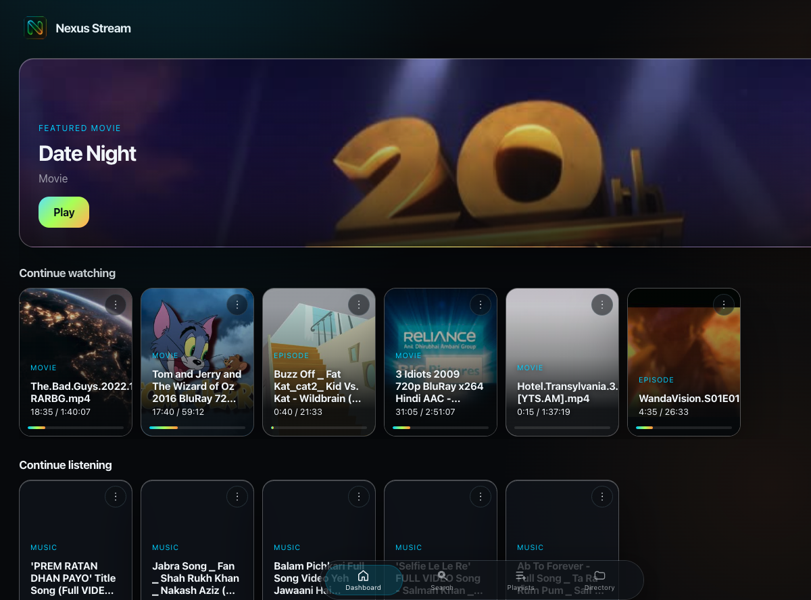
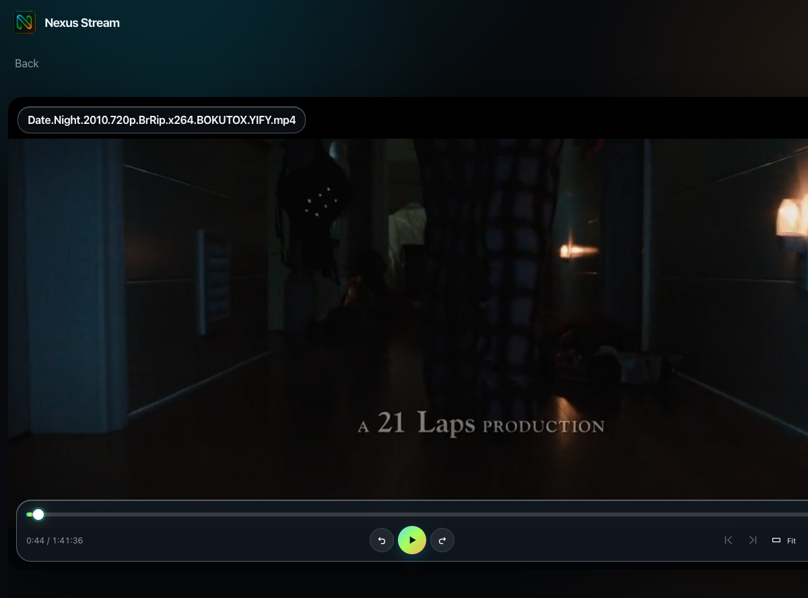
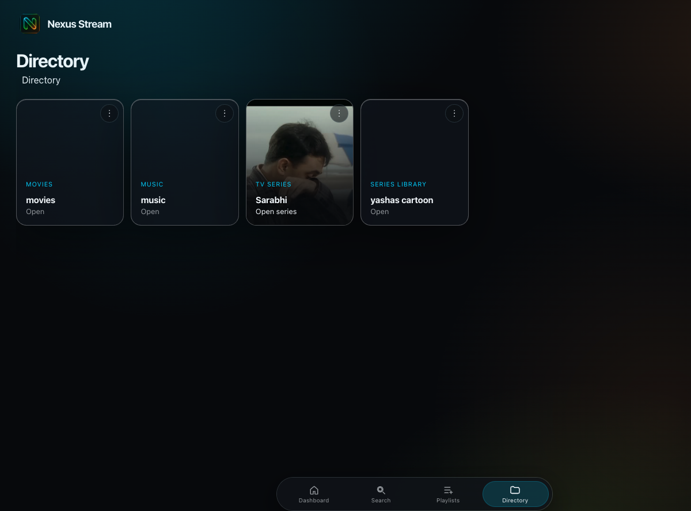
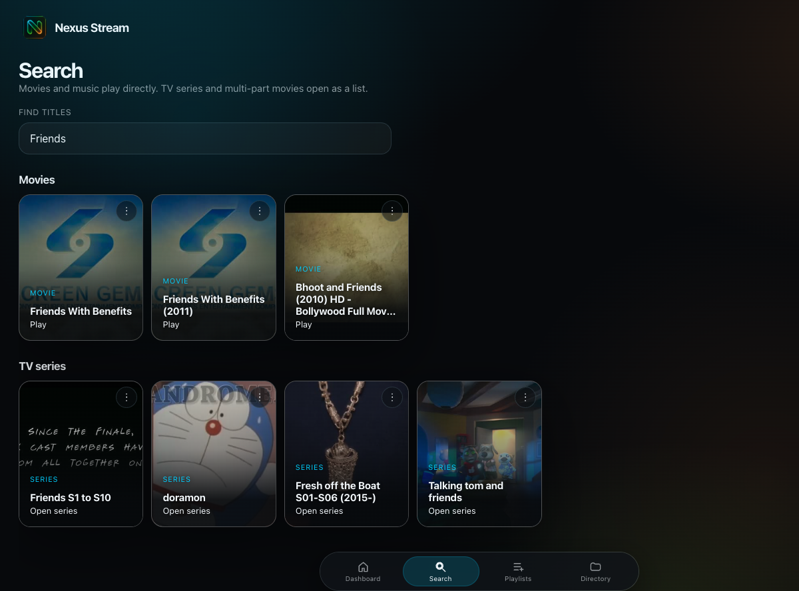
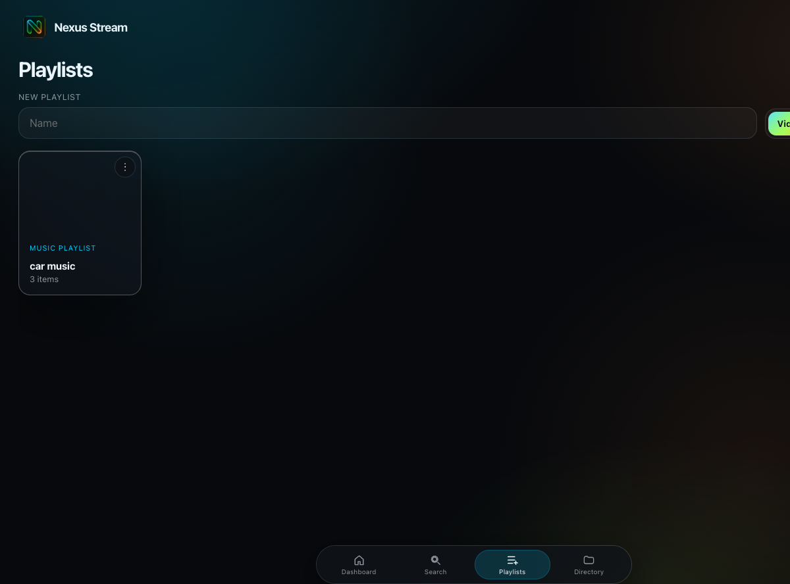
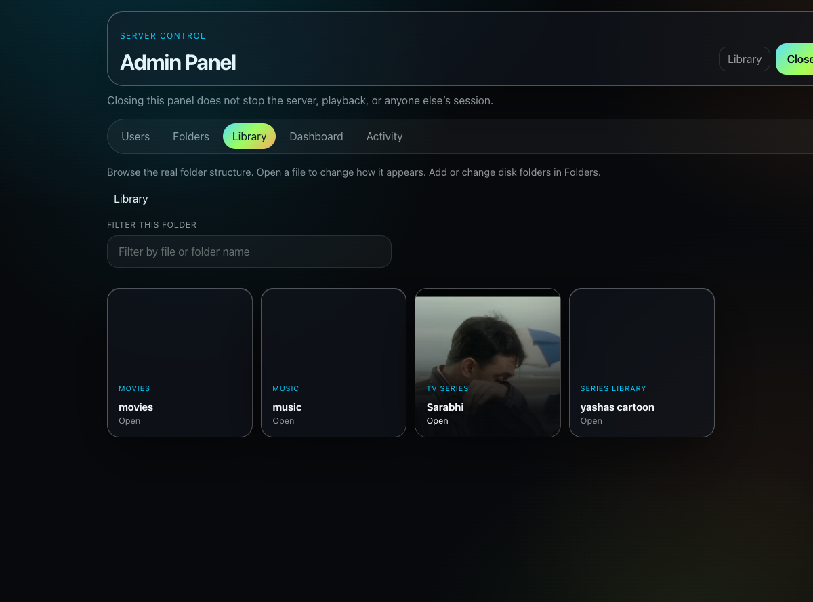

# Nexus Stream

Your movies, TV, cartoons, and music — from folders on the Mac, in a glass interface.

Nexus Stream is a private media app. It scans the libraries you point it at, turns those files into a dashboard of titles, and plays them in the browser. On macOS it also lives in the menu bar so the same library stays available on the local network.

## Watch and listen

The home screen is a featured title, then rails for **Continue watching**, **Continue listening**, suggested movies, series, and music, and whatever you recently added. Progress is personal — each account picks up where it left off.

Video plays in a custom player, not the browser’s built-in chrome:

- Play, pause, skip ten seconds, previous and next
- Seek, volume, fit, fullscreen
- Picture-in-picture
- Speed and subtitles
- Copy-to-disk when a file needs smoother playback

Music keeps playing in a mini player while you browse.

## Browse the library

**Directory** follows the real folders on disk. Movies, music, TV series, and a cartoon library sit side by side. Open a series and you get seasons and episodes. Open a multi-part movie and you get the collection.

**Search** finds titles across the library. Movies and tracks play immediately. Series and collections open as a list.

**Playlists** are yours. A list can hold videos or music, not both.

## Shape how it looks

Admins get a separate panel for the Mac that is hosting the library:

- Attach extra folders so they show up as additional libraries
- Walk the real directory tree
- Change display titles, artwork, and visibility
- Pin recommendations and curate dashboard rails

Hidden titles stay out of everyone else’s library. Accounts sign in individually; continue rails never mix.

---

Nexus Stream is for a household library, not a public catalog.
